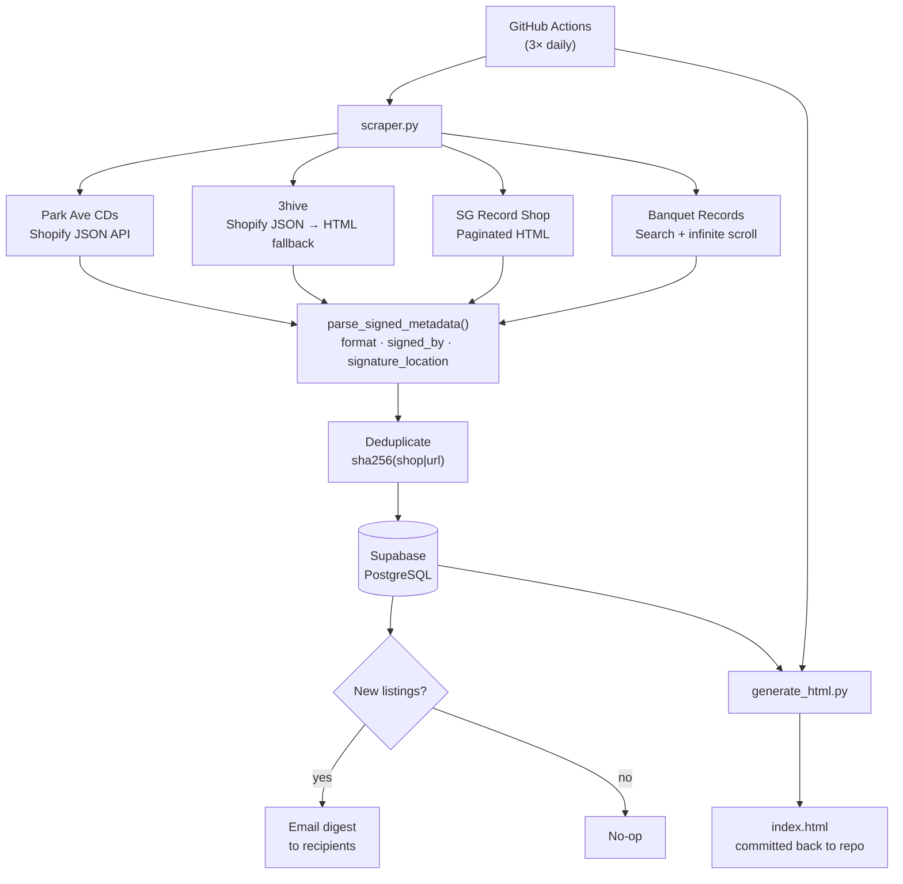
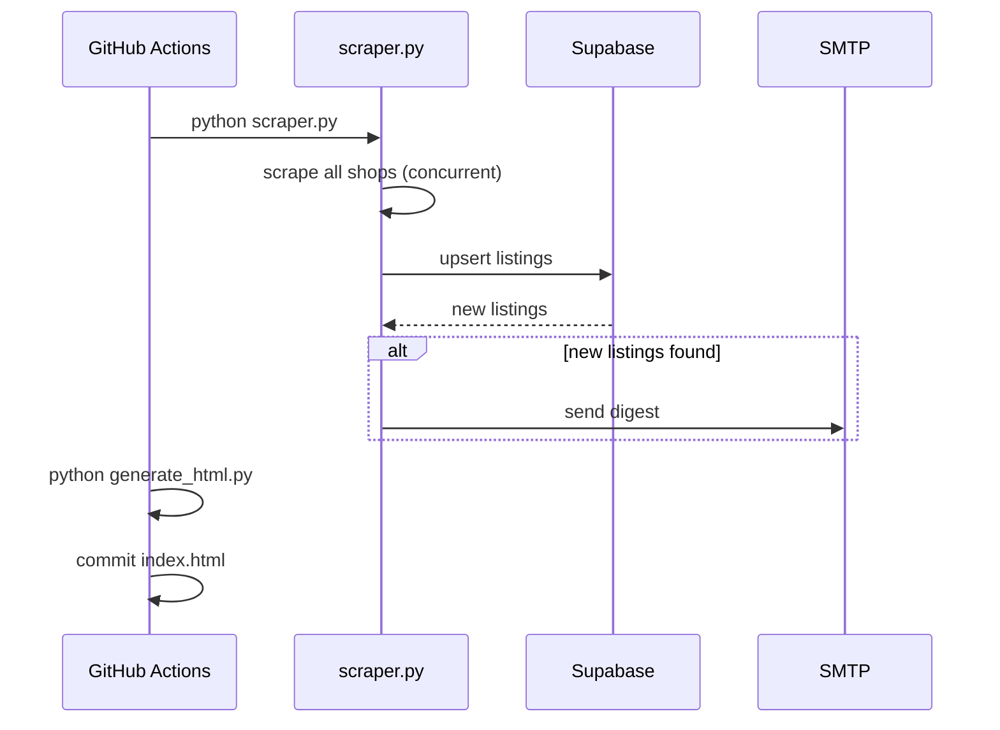

# Autograph Notifier

Monitors online record shops for autographed/signed vinyl and CDs. Runs on a schedule, detects new listings, stores everything in Supabase, sends email digests, and publishes a browseable HTML index.

---

## How it works



### Scraping

Each shop uses the best available strategy:

| Shop | Method |
|---|---|
| Park Ave CDs | Shopify `/products.json` API |
| 3hive | Shopify JSON, falls back to Playwright HTML |
| SG Record Shop | Playwright — paginated catalog |
| Banquet Records | Playwright — search + infinite scroll |

All scrapers run concurrently via `asyncio.gather`. Playwright uses headless Chromium.

### Listing deduplication & detection

Each listing gets a stable 16-char hash of `shop|url`. On every run:
- **Known hash** → `last_seen` timestamp updated, not reported
- **New hash** → inserted with `first_seen`, added to the email digest

### Metadata extraction

`parse_signed_metadata()` regex-parses title + description to classify:
- **Format** — LP, CD, 7", 10", 12", cassette
- **Signed by** — band (full group) or solo member
- **Signature location** — cover, insert, booklet, sleeve, label, lithograph, poster, jacket

### Email digest

Sent via SMTP (Gmail by default) only when new listings are found. Groups listings by shop with thumbnail, title, artist, format badge, price, and buy link.

### HTML page

`generate_html.py` reads listings from Supabase and renders:
- `index.html` (all active listings)
- `new.html` (only listings first seen in the past 7 days)

Both files are committed back to the repo by the workflow after each run.

---

## Schedule

The GitHub Actions workflow runs at **8am, 12pm, and 4pm EST** daily, plus supports manual dispatch.



---

## Setup

### 1. Clone and install

```bash
pip install -r requirements.txt
playwright install chromium
```

### 2. Configure environment

Copy `.env.example` to `.env` and fill in values:

```bash
cp .env.example .env
```

| Variable | Description |
|---|---|
| `SUPABASE_DB_URL` | Postgres connection string from Supabase project settings |
| `EMAIL_ENABLED` | `true` to send emails |
| `EMAIL_SENDER` | Gmail address to send from |
| `EMAIL_PASSWORD` | Gmail app password |
| `EMAIL_RECIPIENTS` | Comma-separated list of recipient addresses |
| `EMAIL_SMTP_SERVER` | Default: `smtp.gmail.com` |
| `EMAIL_SMTP_PORT` | Default: `587` |

### 3. Run locally

```bash
python scraper.py        # scrape + notify
python generate_html.py  # rebuild index.html + new.html
```

### 4. Run tests

```bash
make test
```

This uses `venv/bin/python` when available and falls back to `python3`.

### 5. Run type checks

```bash
make typecheck
```

### 6. Update snapshots

```bash
make snapshot-update
```

### 7. Verify snapshots are current

```bash
make snapshot-check
```

### 8. GitHub Actions

Add all variables from `.env` as **repository secrets**. The workflow at `.github/workflows/scraper.yml` handles the rest.
